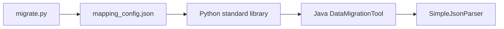

# Data Migration Tool 設計書

| 項目 | 内容 |
|---|---|
| 文書名 | Data Migration Tool 設計書 |
| バージョン | 1.0 |
| 作成日 | 2026-05-12 |
| 対象システム | Python CLI / Java CLI |
| 配置 | `docs/設計書.md` / `docs/設計書.xlsx` |

## 1. はじめに

本書は、`data-migration-tool` の目的、構成、機能、データ、セキュリティ、運用観点を引継ぎ可能な粒度で整理する設計書である。

## 2. システム概要

正規エクスポートデータを Oracle/PostgreSQL/API 取込向け形式へ変換する Python/Java ツール

### 2.1 利用者

- データ移行担当
- DBA
- コンプライアンス確認者

### 2.2 スコープ内

- CSV/TSV/JSON/XML 入力
- 文字コード自動判定
- マッピング設定
- 型・必須・桁数バリデーション
- Oracle/PostgreSQL SQL 出力
- JSON 出力
- DDL 生成

### 2.3 スコープ外

- 実行ファイル解析
- 独自暗号ファイル復号
- 移行先 DB への直接投入

## 3. アーキテクチャ

### 3.1 技術スタック

| 区分 | 採用技術 | 用途 |
|---|---|---|
| 実装 | リポジトリ内ソース | README と主要ファイルに準拠 |

### 3.2 主要ファイル

| パス | 役割 |
|---|---|
| `design_document.xlsx` | 主要ソース/設定ファイル |
| `generate_design_doc.py` | 主要ソース/設定ファイル |
| `mapping_config.json` | 設定 |
| `migrate.py` | 主要ソース/設定ファイル |
| `README.md` | 利用方法・概要 |
| `sample_data.csv` | 主要ソース/設定ファイル |
| `sample_data.json` | 設定 |
| `sample_data.tsv` | 主要ソース/設定ファイル |
| `sample_data.xml` | 設定 |
| `sample_employee.csv` | 主要ソース/設定ファイル |
| `sample_employee.json` | 設定 |
| `java/src/main/java/migration/DataMigrationTool.java` | 主要ソース/設定ファイル |
| `java/src/main/java/migration/SimpleJsonParser.java` | 主要ソース/設定ファイル |

## 4. データ・設定モデル

| データ | 形式 | 説明 |
|---|---|---|
| 入力 | CSV/TSV/JSON/XML | 正規エクスポートデータ |
| 設定 | JSON | テーブル、カラム、型、制約 |
| 出力 | SQL/JSON/DDL/log | 移行用成果物 |

## 5. 機能仕様

| ID | 機能 | 仕様 |
|---|---|---|
| F-01 | 入力読込 | 複数フォーマットを自動判別してレコード化する。 |
| F-02 | マッピング | mapping_config.json に従い列名・型を変換する。 |
| F-03 | 検証 | 必須、型、最大長などを行単位で検証する。 |
| F-04 | 出力 | Oracle/PostgreSQL SQL、JSON、DDL、エラーログを生成する。 |

## 6. セキュリティ・品質

- 正規エクスポートデータのみを対象とし、リバースエンジニアリングを行わない。
- エラー行はスキップしログで追跡可能にする。

## 7. デプロイ・運用

- python migrate.py --config mapping_config.json
- javac/java で Java 版を実行
- サンプルデータで変換確認

## 8. 既知の制約と今後の拡張

- 自動変換・自動判定を含む機能は、利用者または担当者レビューを前提とする。
- 本番利用前に対象データ、権限、ログ、バックアップ、例外処理を運用環境に合わせて確認する。
- README と実装差分が出た場合は、実装側を正として本書を更新する。

## 付録 A. 改訂履歴

| 版 | 日付 | 内容 |
|---|---|---|
| 1.0 | 2026-05-12 | 初版作成 |
